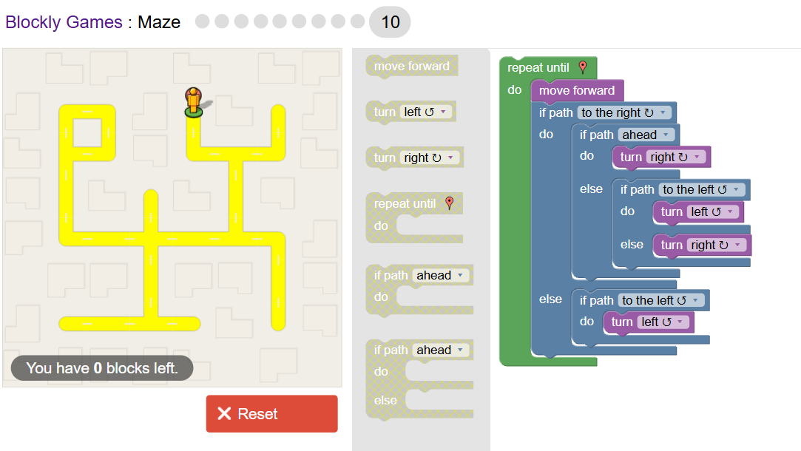
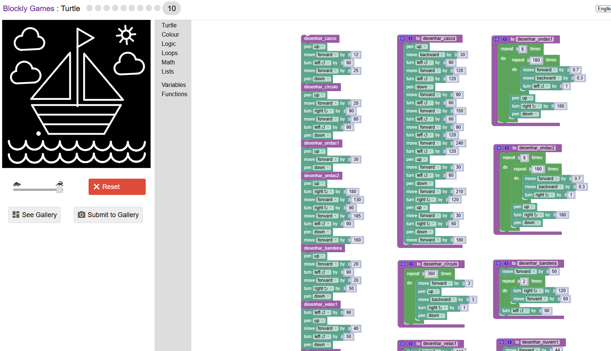
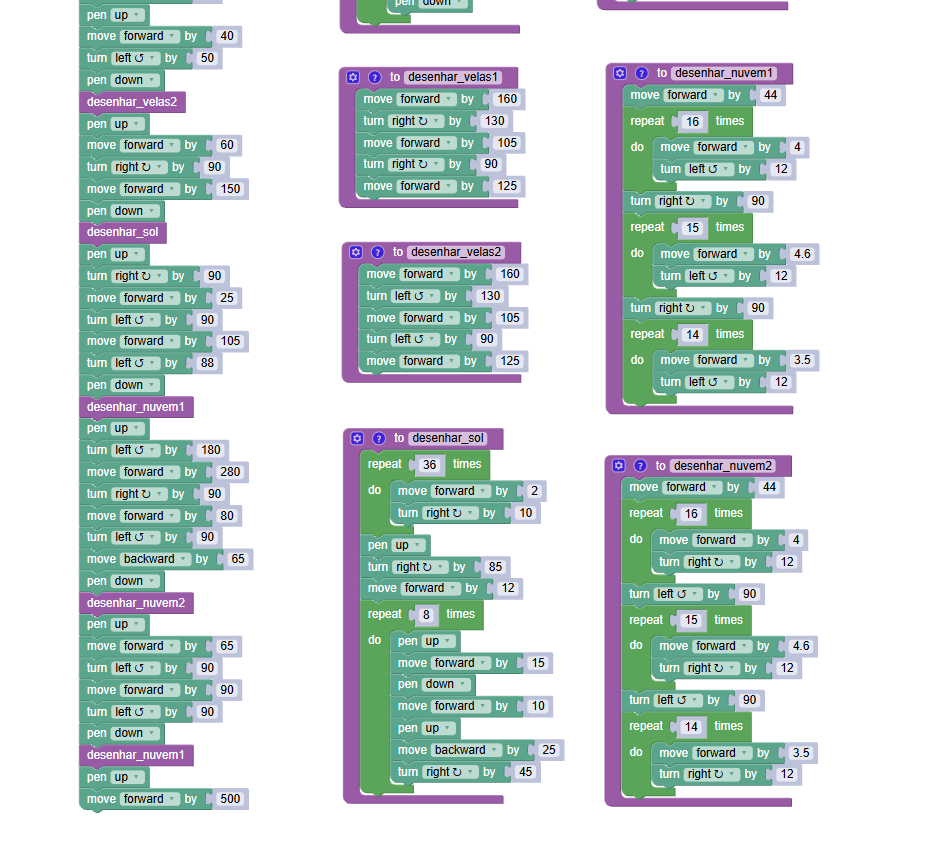

## Autor 

- Diana Oliveira Rachas
- A109975

## Resumo 

Fizemos o maze 10.
Fizemos a figura do barco à vela que o professor deu

## Resultados
*Imagem com o programa do meze: 
*Imagem com o barco:  
